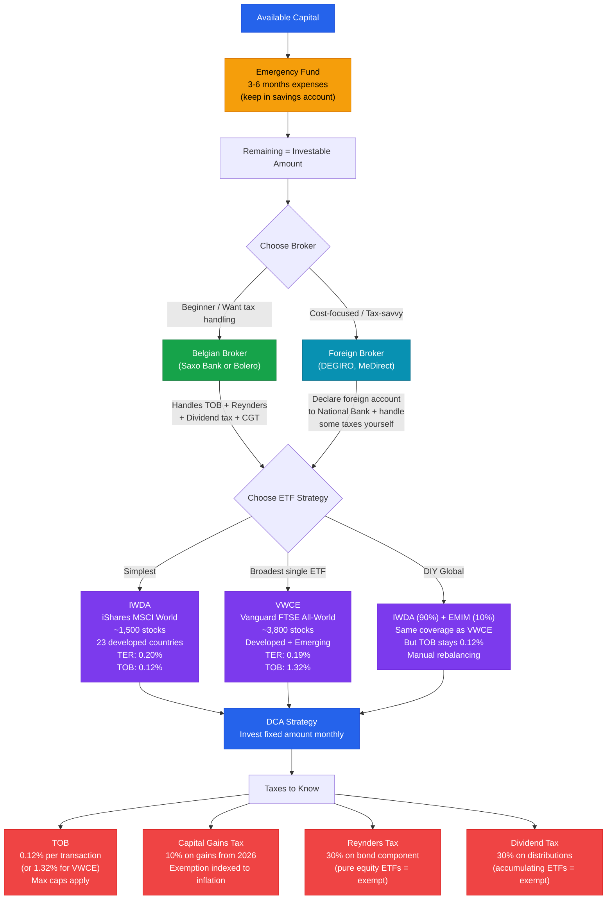

# Investment Decision Tree

A visual overview of the Belgian ETF investment process — from initial capital to tax implications.

## Legend

| Node Color | Category |
|------------|----------|
| Blue | Starting point / strategy |
| Amber | Safety-first step (emergency fund) |
| Green | Belgian broker path |
| Cyan | Foreign broker path |
| Purple | ETF options |
| Red | Tax obligations |

### Reading the flowchart

1. **Start** with your available capital
2. **Fund your emergency reserve** before investing anything
3. **Choose a broker** based on your comfort with tax admin (Belgian = hands-off, foreign = cheaper but more work)
4. **Pick an ETF strategy** — IWDA is simplest, VWCE is broadest, IWDA+EMIM is the cost-optimized combo
5. **Deploy via DCA** — spread your initial capital over months, then continue with monthly contributions
6. **Understand the taxes** — all paths lead to the same four taxes, but your broker choice determines how much you handle yourself
